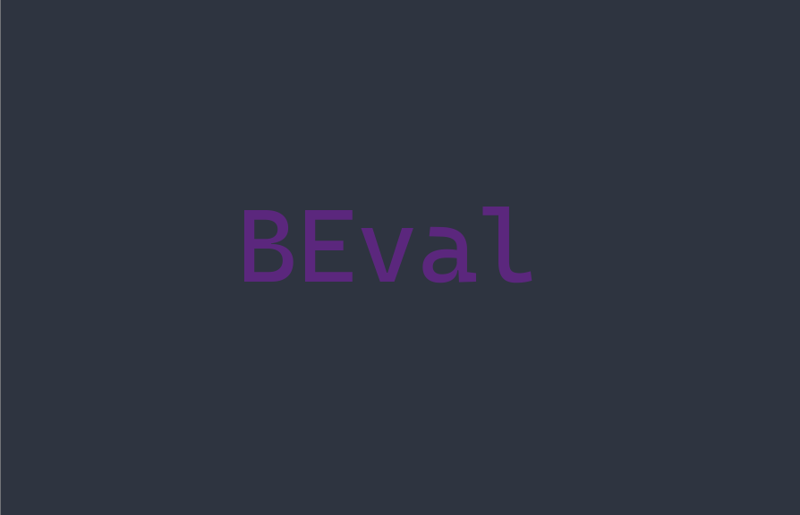

 

### A maths evaluator written in C

#### Supports:

- [x] Normal operators like `+, -, * and /`
- [x] Functions like `sin(), cos(), tan(), log(), sqrt()`
- [x] Parenthesis
- [x] Exponents

### Building

`make`

### Plans

- [x] Support for bitwise operators i.e. `&, <<, >>`
- [x] Functions with multiple arguments
